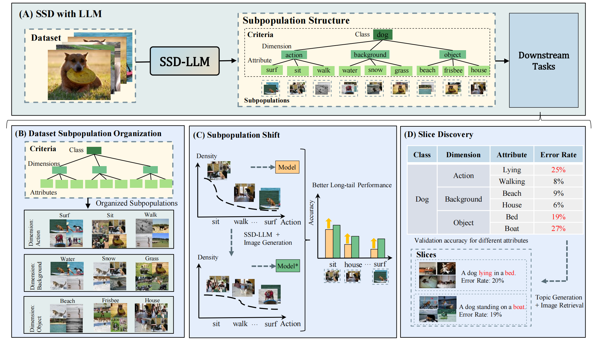

# SSD-LLM [ECCV 2024]

<p align="center">
  <a href="https://arxiv.org/abs/2405.02363">
    
  </a>
  <a href="https://link.springer.com/chapter/10.1007/978-3-031-73414-4_14">
    
  </a>
  <a href="https://www.youtube.com/watch?v=pw-ZPzlXtQA">
    
  </a>
  <a href="https://llm-as-dataset-analyst.github.io/">
    
  </a>
</p>

---

## 🔗 Featured Resources

- 📄 **Paper (arXiv)**: [LLM as Dataset Analyst](https://arxiv.org/abs/2405.02363)  
- 📘 **ECCV 2024 Camera Ready**: [Springer Link](https://link.springer.com/chapter/10.1007/978-3-031-73414-4_14)  
- 🌐 **Project Website**: [llm-as-dataset-analyst.github.io](https://llm-as-dataset-analyst.github.io/)  
- 🎬 **Video Presentation**: [YouTube](https://www.youtube.com/watch?v=pw-ZPzlXtQA)

> 🧠 *Discover subpopulation structures using Large Language Models (LLMs) with linguistic interpretability and automation.*

---

<div align="center">
  
</div>

---

## 🧩 Overview

**SSD-LLM** is an innovative framework for discovering subpopulation structures within datasets using Large Language Models (LLMs). By leveraging LLMs' extensive world knowledge and advanced reasoning capabilities, SSD-LLM offers:

- ✨ **Linguistically Interpretable Subpopulation Discovery**  
- 🤖 **Automated Dataset Analysis via LLMs**  
- 🔄 **Comprehensive & Modular Workflow**  
- 🔌 **Flexible Integration with Various MLLMs and LLMs**

**Future Directions**:
- 📊 Exploration of diverse subpopulation structures  
- 🖼️ Expansion to vision and multimodal tasks  
- ✅ Contribution to unbiased dataset creation

---

## ⚙️ Installation

1. **Clone the repository**:
   ```bash
   git clone https://github.com/llm-as-dataset-analyst/SSDLLM.git
   ```

2. **Navigate to the project directory**:
   ```bash
   cd SSDLLM
   ```

3. **Install dependencies**:
   ```bash
   pip install -e .
   ```

---

## Project Structure

1. `captions`: Contains pre-captioned datasets using `llava1.5-7b`. These can be used directly.

2. `config`:
   - `0_summary.yaml` sets hyperparameters for different stages of the SSDLLM pipeline. Adjust these when running different datasets. The used hyperparameters are automatically saved in the `output` directory when running the code.
   - Other YAML files correspond to different datasets, including task name, dataset name, class count, and average count per class. These settings affect the final processing form, so they need to be configured properly. Examples are provided for reference.
   - You can format your own dataset similarly in YAML.

3. `run.sh`: 
   - Sets the execution logic for the entire codebase. You can modify the `mllm` and `llm` names, but ensure the preparation of corresponding MLLM and LLM exist.

## Configuration

1. Open the `utils.py` file and locate the following code snippet:

   ```python
   api_key=""
   ```

   Replace `api_key` with your OpenAI API key.

2. Open the `run.sh` file and modify the following parameters as needed:

   ```bash
   mllm_name=llava1.5-7b
   llm_name=gpt-3.5-turbo
   
   for class_name in mood
   ```

   `mllm_name`: Specify the multimodal language model to use (e.g., llava1.5-7b)
   
   `llm_name`: Choose the language model (e.g., gpt-3.5-turbo, gpt-4)
   
   `class_name`: Set the dataset name you need to process. The available dataset names that can be executed directly are listed in the config folder.

   Make sure the corresponding configurations for your chosen models are properly set up.

3. Custom Dataset Captioning
   - To caption your own dataset, refer to `step1_image_caption/scripts_infer_batch.sh` for modifications.
   - Prepare your dataset in a format readable by PyTorch's `ImageFolder`, e.g.,

     ```
     dataset
     ├── imagenet
     │   ├── bird
     │   ├── boat
     │   ├── cat
     │   ├── dog
     ```

   - Different MLLMs can be used for captioning, and you can modify them for batch inference from Hugging Face demos.

## Usage

Run the following command to start the script:

   ```bash
   bash run.sh
   ```

## Acknowledgement

This project is benefited from the following repositories:
- [ICTC](https://github.com/sehyunkwon/ICTC)
- [LLAVA](https://github.com/haotian-liu/LLaVA)

Thanks for their great works!

## Citation

If you find this project useful, please cite using this BibTeX:

```
@inproceedings{luo2025llm,
  title={LLM as dataset analyst: Subpopulation structure discovery with large language model},
  author={Luo, Yulin and An, Ruichuan and Zou, Bocheng and Tang, Yiming and Liu, Jiaming and Zhang, Shanghang},
  booktitle={European Conference on Computer Vision},
  pages={235--252},
  year={2025},
  organization={Springer}
}
```